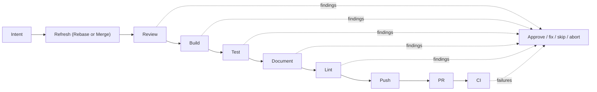

The pipeline runs a fixed, opinionated sequence of steps. Order is not configurable. What each step runs *is*.

```
intent → refresh → review → build → test → document → lint → push → pr → ci
```



This page is the overview. For each step's exact behavior, defaults, skip rules, and fix-commit format, see [Pipeline Steps](/no-mistakes/reference/pipeline-steps/).

## What a passed gate means

The pipeline is opinionated so that "passed the gate" has a stable meaning:

- the branch was checked against fresh remote upstream and the pushed-branch target first
- review, build, tests, user-facing test evidence when available, docs, and lint happened before any branch push to the configured target
- the human stayed in control when a step needed judgment
- the final branch update was guarded against discarding unincorporated commits already on the push target
- push, PR creation, and CI monitoring only happened after the local gate was satisfied

## Execution vocabulary

- An **attempt** is one actual controller-launched execution of a resolved pipeline command. Repeated executions remain separate attempts even when the script and runner are identical.
- A **retry** is a later attempt of the same operation, input, and target after a failure, with the same tested head and clean input state and no intervening repository mutation. When this happens after a repair round without a state change, it is recorded with the reason `unchanged_after_repair`; a changed state remains a new attempt.

## The ten steps

| # | Step | What it does | Default auto-fix limit |
|---|---|---|---|
| 1 | **Intent** | Use supplied intent or infer it from recent local agent transcripts | n/a |
| 2 | **Refresh** (`Rebase` or `Merge`) | Fetch fresh remote upstream and the configured branch target, then incorporate them with the selected strategy | `3` |
| 3 | **Review** | AI code review of your diff | `0` (requires approval) |
| 4 | **Build** | Compile the changed production code with a configured command or agent-selected build | `3` |
| 5 | **Test** | Targeted local validation of the change and intent (not a full CI suite), plus evidence when intent is available | `3` |
| 6 | **Document** | Update docs when needed and report unresolved gaps | initial pass |
| 7 | **Lint** | Run lint/static analysis; plan one exact command read-only when none is configured | `3` |
| 8 | **Push** | Safely push the validated branch to the configured target | n/a |
| 9 | **PR** | Create the pull request, or adopt the existing one | n/a |
| 10 | **CI** | Watch CI + mergeability, auto-fix failures | `3` |

## Why these steps, in this order

- **Intent first** so downstream agent prompts, including PR drafting, can use author intent supplied by the agent or inferred from transcripts.
- **Refresh next** so everything else runs against the latest upstream and pushed-branch target.
  It also stops when the branch would silently bundle commits from a local default branch that were never pushed to `origin/<default_branch>`.
  If there's no diff left after refresh, the pipeline skips the rest.
- **Review before build and test** so semantic review happens before deterministic verification and any repair commits.
  A later run's initial review also receives fix-round provenance for any uncertified pipeline-authored commits left on the branch when a previous run's re-review did not complete.
- **Build before test** so compile failures are isolated from behavioral test failures.
- **Document after test** so docs are updated against code that's known to work.
- **Lint last among local checks** so it doesn't churn over code that may still change.
- **Push → PR → CI** happens after all local checks pass.
  The push and CI auto-fix paths refuse to overwrite commits that reached the configured push target out of band.
  CI is the only step that talks to the outside world for validation.

## What each step can do

Every step can:

- **Complete** cleanly and advance the pipeline.
- **Return findings** with severity (`error`, `warning`, `info`) and an action (`auto-fix`, `ask-user`, `no-op`).
- **Trigger auto-fix** if the step's `auto_fix` limit is above 0, the step result is auto-fixable, and any finding is `auto-fix`-eligible. The document step applies safe documentation fixes during its initial pass and, when `commands.lint` is empty, combines that pass with initial safe lint fixes before the lint step consumes its findings.
- **Pause for approval** if blocking findings remain after auto-fix, or if any finding is `ask-user`.
- **Skip** when there's nothing to do (e.g., no diff, unsupported host).
- **Fail** on fatal errors and stop the pipeline.

See [Auto-Fix Loop](/no-mistakes/concepts/auto-fix/) for how the fix cycle works, and [Using the TUI](/no-mistakes/guides/tui/) for what the approval UI looks like.

## What you can configure

You can't reorder steps. You *can*:

- Swap the agent, or configure an ordered fallback list, globally or per-repo.
- Set explicit `commands.lint`, `commands.format`, and an optional **targeted** `commands.test` (local intent validation only; not a full CI suite).
- Store complete test evidence in owner-local retention outside the worktree; no pipeline step publishes it to a Git branch or PR attachment.
- Control auto-fix limits per step.
- Select `refresh.strategy: rebase|merge` in trusted repo config, override it for one run with `--refresh-strategy`, and declare a stack base with `--stacked-on <branch>`.
- Ignore paths during review and documentation checks.
- Disable or tune transcript-based intent extraction when intent is not supplied directly.
- Skip steps for one run with `no-mistakes --skip <steps>`, `git push -o no-mistakes.skip=<steps>`, `no-mistakes axi run --skip <steps>`, or from the TUI.

See [Configuration](/no-mistakes/guides/configuration/).

## What you can't configure

- The step order.
- Skipping specific steps permanently - per-run skips are allowed, but the pipeline itself always has all ten.
- Adding new steps.

This is intentional. The pipeline is opinionated so that "passed the gate" means the same thing across repos.
